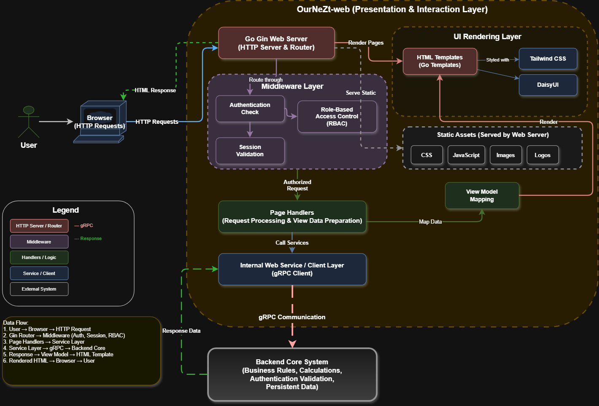

<a id="readme-top"></a>

<!-- PROJECT SHIELDS -->
<p align="center">
  <a href="https://github.com/OurNeZt/OurNeZt-web/actions/workflows/ci.yaml">
    
  </a>
  <a href="https://github.com/OurNeZt/OurNeZt-web/releases">
    
  </a>
  <a href="https://github.com/OurNeZt/OurNeZt-web/blob/stable/LICENSE">
    
  </a>
  <a href="https://github.com/OurNeZt/OurNeZt-web/pkgs/container/ournezt-web">
    
  </a>
</p>

<!-- PROJECT LOGO -->
<br />
<div align="center">
  <a href="https://github.com/OurNeZt/OurNeZt-web">
    
  </a>

  <h1 align="center">OurNeZt Web</h1>

  <p align="center">
    Browser-facing web application for household finance, housing planning, and family dashboard workflows.
    <br />
    <br />
    <a href="https://github.com/OurNeZt/OurNeZt-web/issues/new?labels=bug&template=bug-report.md">Report Bug</a>
    &middot;
    <a href="https://github.com/OurNeZt/OurNeZt-web/issues/new?labels=enhancement&template=feature-request.md">Request Feature</a>
    &middot;
    <a href="https://github.com/OurNeZt/OurNeZt-web/releases">Releases</a>
  </p>
</div>

---

<!-- TABLE OF CONTENTS -->
<details>
  <summary>Table of Contents</summary>
  <ol>
    <li>
      <a href="#about-the-project">About The Project</a>
      <ul>
        <li><a href="#what-it-does">What It Does</a></li>
        <li><a href="#built-with">Built With</a></li>
      </ul>
    </li>
    <li><a href="#architecture-overview">Architecture Overview</a></li>
    <li>
      <a href="#getting-started">Getting Started</a>
      <ul>
        <li><a href="#prerequisites">Prerequisites</a></li>
        <li><a href="#installation">Installation</a></li>
        <li><a href="#configuration">Configuration</a></li>
      </ul>
    </li>
    <li><a href="#running-the-web-app">Running The Web App</a></li>
    <li><a href="#testing">Testing</a></li>
    <li><a href="#docker">Docker</a></li>
    <li><a href="#release-flow">Release Flow</a></li>
    <li><a href="#roadmap">Roadmap</a></li>
    <li><a href="#contributing">Contributing</a></li>
    <li><a href="#license">License</a></li>
    <li><a href="#contact">Contact</a></li>
  </ol>
</details>

---

## About The Project

**OurNeZt Web** is the web application layer for the OurNeZt ecosystem. It provides the browser-facing interface for household finance planning, family management, person profiles, income visibility, housing affordability workflows, and dashboard views.

This repository is designed to act as the main web client for OurNeZt. It uses Go with Gin for the web server and routing layer, while DaisyUI and Tailwind CSS are used for styling the user interface. The web app is intended to communicate with **OurNeZt Core** through gRPC, keeping the frontend/web layer separated from the backend domain logic.

<p align="right">(<a href="#readme-top">back to top</a>)</p>

---

## What It Does

OurNeZt Web currently focuses on the user-facing experience for:

- Login, session handling, and authenticated web access.
- Admin-created user onboarding and first-time password flow.
- Family and household dashboard views.
- Family creation, joining, invite code, and member management workflows.
- Person profile forms for household members.
- Income, CPF, cash savings, expenses, and surplus display.
- Housing option forms for BTO, resale, EC, private, and other housing types.
- Housing affordability dashboard views powered by backend calculations.
- Responsive web pages styled with DaisyUI and Tailwind CSS.

The web app is built as a lightweight server-rendered Go application. It should remain focused on routing, templates, page rendering, user interaction, and calling the backend Core service instead of duplicating finance or housing business logic.

---

## Built With

<p align="left">
  
  
  
  
  
  
  
  
  
</p>

<p align="right">(<a href="#readme-top">back to top</a>)</p>

---

## Architecture Overview

<p align="center">
  
</p>

OurNeZt Web is designed as the browser-facing application layer for the OurNeZt platform. Users interact with the web interface through a browser, while the Gin web server handles routing, middleware, sessions, templates, static assets, and page rendering.

At the centre of the web architecture is the **OurNeZt Web Server**, which acts as the bridge between the browser and the backend Core service. The web app should not own the main business rules for CPF, housing affordability, dashboard aggregation, or household finance calculations. Instead, it calls **OurNeZt Core** over gRPC and renders the returned data into user-friendly pages.

The web application is split into focused areas:

- **Web Router** handles HTTP routes, page navigation, redirects, and route grouping.
- **Middleware Layer** handles request logging, session checks, authentication guards, and common request context.
- **Template Layer** renders HTML pages, layouts, partials, forms, and reusable UI components.
- **Static Asset Layer** serves compiled CSS, JavaScript, images, and application assets.
- **gRPC Client Layer** communicates with OurNeZt Core for authentication, family, person, finance, housing, and dashboard data.
- **UI Pages** provide user-facing screens for login, dashboards, family management, profile management, housing planning, and affordability summaries.

The expected flow is:

```text
Browser
  -> OurNeZt Web HTTP/Gin Server
  -> Auth/session middleware
  -> Page handler
  -> OurNeZt Core gRPC API
  -> PostgreSQL through Core
  -> Core response
  -> HTML template rendered by Web
  -> Browser
```

This keeps the web repository focused on user experience, page composition, and frontend interaction, while the Core repository remains responsible for backend APIs, domain logic, persistence, and calculations.

<p align="right">(<a href="#readme-top">back to top</a>)</p>

---

## Getting Started

### Prerequisites

Install the following tools:

- Go
- Docker
- A running OurNeZt Core service

Optional but recommended:

- `make`
- `grpcurl`
- Docker Compose

---

### Installation

Clone the repository:

```bash
git clone git@github.com:OurNeZt/OurNeZt-web.git
cd OurNeZt-web
```

Install Go dependencies:

```bash
go mod download
```

Run tests:

```bash
go test ./...
```

<p align="right">(<a href="#readme-top">back to top</a>)</p>

---

## Configuration

The web app is configured using environment variables.

Example:

```bash
export APP_ENV=development
export WEB_ADDR=:8080
export CORE_GRPC_ADDR=localhost:50051
export SESSION_COOKIE_NAME=ournezt_session
export SESSION_COOKIE_MAX_AGE=12h
export SESSION_COOKIE_SECURE=false
export REQUEST_TIMEOUT=5s
```

### Environment Variables
| Variables | Description | Example |
| --- | --- | --- |
| `APP_ENV` | Application environment. Usually `development` or `production`. | `development` |
| `WEB_ADDR` | HTTP bind address for the Gin web server. | `:8080` |
| `CORE_GRPC_ADDR` | Address of the running OurNeZt core gRPC service. | `localhost:50051` |
| `SESSION_COOKIE_NAME` | Name of the browser session cookie. | `ournezt_session` |
| `SESSION_COOKIE_MAX_AGE` | Session cookie lifetime. | `12h` |
| `SESSION_COOKIE_SECURE` | Whether the session cookie requires HTTPS. Set to `true` in production. | `false` |
| `REQUEST_TIMEOUT` | Timeout used when making requests to OurNeZt Core. | `5s` |

### Session Behaviour
OurNeZt Web stores the session token in an HTTP-only browser cookie. For authenticated backend calls, the token is forwarded to OurNeZt Core as gRPC metadata: `x-session-token: <session-token>`

If OurNeZt Core returns that a user must change their password, the web app redirects the user to: `/change-password`. This ensures bootstrap-created admin users and password-reset users update their password before continuing to other authenticated pages.

---

## Running The Web App

Run locally:

```bash
go run ./cmd/web
```

The web server should start using the configured bind address.

Example:

```bash
open http://localhost:8080
```

<p align="right">(<a href="#readme-top">back to top</a>)</p>

---

## Testing

Run all tests:

```bash
go test ./...
```

Run tests with verbose output:

```bash
go test -v ./...
```

Run tests with coverage:

```bash
go test -v -cover ./...
```

Generate an HTML coverage report:

```bash
go test -coverprofile=coverage.out ./...
go tool cover -html=coverage.out
```

<p align="right">(<a href="#readme-top">back to top</a>)</p>

---

## Docker

Build the image locally:

```bash
docker build -t ournezt-web:local .
```

Run the container:

```bash
docker run --rm \
  -p 8080:8080 \
  -e APP_ENV="production" \
  -e WEB_ADDR=":8080" \
  -e CORE_GRPC_ADDR="host.docker.internal:50051" \
  -e SESSION_COOKIE_NAME="ournezt_session" \
  -e SESSION_COOKIE_MAX_AGE="24h" \
  -e SESSION_COOKIE_SECURE="true" \
  -e REQUEST_TIMEOUT="5s" \
  ournezt-web:local
```

Container startup behavior:

- Starts the Gin web server.
- Serves compiled templates and static assets.
- Connects to OurNeZt Core using `CORE_GRPC_ADDR`.
- Uses browser cookies or session middleware for authenticated page access.

Released images are published to GitHub Container Registry:

```bash
docker pull ghcr.io/OurNeZt/ournezt-web:latest
```

or for a specific release:

```bash
docker pull ghcr.io/OurNeZt/ournezt-web:vX.Y.Z
```

<p align="right">(<a href="#readme-top">back to top</a>)</p>

---

## Release Flow

This repository uses a controlled release flow:

```text
dev -> release/vX.Y.Z -> stable
```

The release process is:

1. Run the `prepare-release` workflow manually.
2. Select the version bump type: `patch`, `minor`, or `major`.
3. The workflow creates a `release/vX.Y.Z` branch and updates `CHANGELOG.md`.
4. Review and update the generated changelog entry.
5. Merge the release PR into `stable`.
6. The `release` workflow creates the Git tag, GitHub Release, and Docker images.

Docker images are tagged as:

```text
ghcr.io/OurNeZt/ournezt-web:vX.Y.Z
ghcr.io/OurNeZt/ournezt-web:latest
```

<p align="right">(<a href="#readme-top">back to top</a>)</p>

---

## Roadmap

- [x] Web application foundation
- [x] Gin server setup
- [x] Tailwind CSS and DaisyUI CDN integration
- [x] HTML template structure
- [x] Static asset handling
- [x] Authentication pages
- [x] Session middleware integration
- [x] gRPC client integration with OurNeZt Core
- [x] Family and household dashboard pages
- [x] Person profile management pages
- [ ] Finance and CPF dashboard views
- [ ] Housing affordability planning pages
- [ ] Responsive UI polish
- [ ] Docker image build and release workflow
- [ ] Deployment manifests
- [ ] Observability, metrics, and structured logging

See the [open issues](https://github.com/OurNeZt/OurNeZt-web/issues) for planned improvements and known issues.

<p align="right">(<a href="#readme-top">back to top</a>)</p>

---

## Contributing

Contributions are welcome.

For normal development:

1. Create a feature branch from `dev`.

   ```bash
   git checkout dev
   git pull
   git checkout -b feature/your-feature-name
   ```

2. Make your changes.

3. Run tests and build checks.

   ```bash
   go test ./...
   ```

4. Commit your changes using a conventional commit style.

   ```bash
   git commit -m "feat: add new web capability"
   ```

5. Open a pull request into `dev`.

For release preparation, use the release workflow instead of manually creating tags.

<p align="right">(<a href="#readme-top">back to top</a>)</p>

---

## License

Distributed under the Apache License 2.0. See `LICENSE` for more information.

<p align="right">(<a href="#readme-top">back to top</a>)</p>

---

## Contact

Project Organisation: [OurNeZt](https://github.com/OurNeZt)

Repository: [https://github.com/OurNeZt/OurNeZt-web](https://github.com/OurNeZt/OurNeZt-web)

<p align="right">(<a href="#readme-top">back to top</a>)</p>
